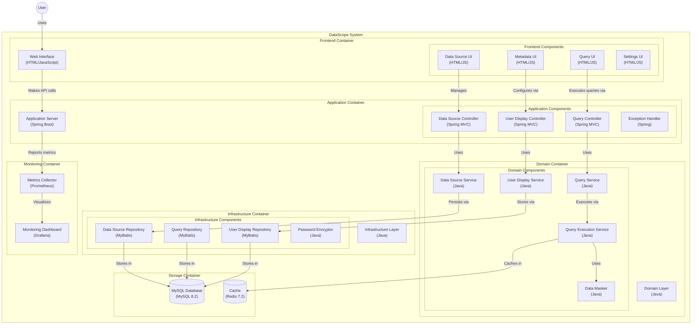

## System Patterns

### 整体架构

### How the system is built?

The DataScope system is built using a modular, layered architecture with the following modules:

* **data-scope-app:** The application module containing the controllers, DTOs, and API definitions.
* **data-scope-domain:** The domain module containing the core business logic and entities.
* **data-scope-facade:** The facade module providing a simplified interface to the domain layer.
* **data-scope-infrastructure:** The infrastructure module containing the data access layer and external integrations.
* **data-scope-main:** The main module responsible for bootstrapping the application.

The system uses a microservices-inspired architecture, with clear separation of concerns between the modules.

### Key technical decisions?

* **Technology Stack:** Java, Maven, Spring Boot, MyBatis, MySQL, Redis
* **API Protocol:** JSON-based interaction protocol for low-code platform integration
* **Security:** Password encryption with salt and AES
* **Extensibility:** Pluggable architecture for supporting different data source types
* **Scalability:** Versioned APIs to ensure backward compatibility
* **Data Masking:** Comprehensive data masking strategy with multiple masking types and customization options
* **Query Execution:** Stateful query execution with tracking and management capabilities

### Architecture patterns?

* **DDD (Domain-Driven Design):** The domain module follows DDD principles to model the business domain.
* **Repository Pattern:** The infrastructure module uses the repository pattern to abstract data access.
* **Facade Pattern:** The facade module provides a simplified interface to the domain layer.
* **Strategy Pattern:** Used in the data masking implementation to support different masking strategies.
* **Builder Pattern:** Used in model classes like QueryResult and SqlMetadata for flexible object creation.
* **State Pattern:** Used in the QueryExecution model to track and manage query execution states.
* **Microservices-inspired Architecture:** The modular architecture allows for independent deployment and scaling of
  individual modules.
