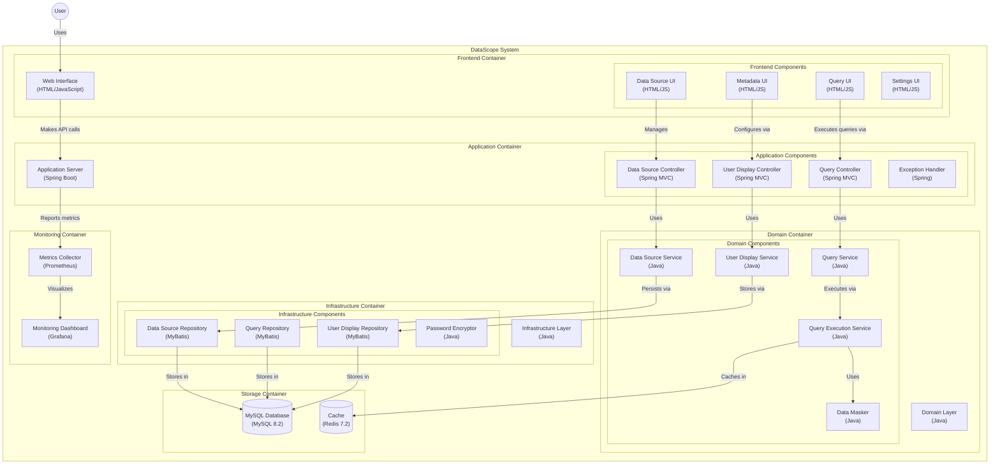

## 系统模式

### 整体架构

### 系统构建方式

DataScope 系统采用模块化、分层架构，包含以下模块：

* **data-scope-app：** 应用模块，包含控制器、DTO 和 API 定义。
* **data-scope-domain：** 领域模块，包含核心业务逻辑和实体。
* **data-scope-facade：** 外观模块，为领域层提供简化的接口。
* **data-scope-infrastructure：** 基础设施模块，包含数据访问层和外部集成。
* **data-scope-main：** 主模块，负责引导应用程序启动。

系统采用微服务启发的架构，模块之间有明确的关注点分离。

### 关键技术决策

* **技术栈：** Java、Maven、Spring Boot、MyBatis、MySQL、Redis
* **API 协议：** 基于 JSON 的交互协议，用于低代码平台集成
* **安全性：** 使用盐和 AES 进行密码加密
* **可扩展性：** 可插拔架构，支持不同的数据源类型
* **可扩展性：** 版本化 API，确保向后兼容
* **数据掩码：** 全面的数据掩码策略，具有多种掩码类型和自定义选项
* **查询执行：** 有状态的查询执行，具有跟踪和管理功能

### 架构模式

* **DDD（领域驱动设计）：** 领域模块遵循 DDD 原则来建模业务领域。
* **仓库模式：** 基础设施模块使用仓库模式抽象数据访问。
* **外观模式：** 外观模块为领域层提供简化的接口。
* **策略模式：** 在数据掩码实现中使用，支持不同的掩码策略。
* **构建器模式：** 在 QueryResult 和 SqlMetadata 等模型类中使用，实现灵活的对象创建。
* **状态模式：** 在 QueryExecution 模型中使用，跟踪和管理查询执行状态。
* **微服务启发的架构：** 模块化架构允许独立部署和扩展各个模块。
